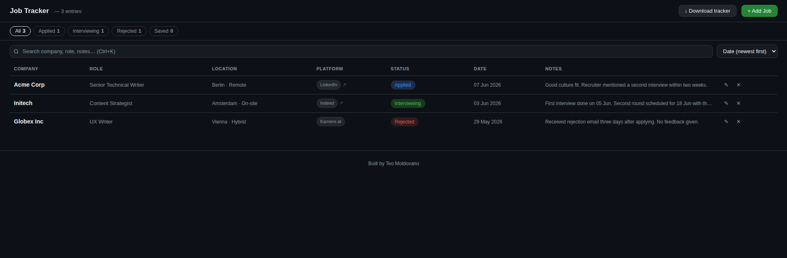

# Job Tracker

A lightweight, privacy-first job application tracker that runs entirely in your browser. No sign-up, no server, no data sent anywhere.

**[Open the tracker →](https://teokitten.github.io/job-tracker)**

## What it does

Log every job application in one place – company, role, location, platform, status, date, and notes. Filter by status (Applied, Interviewing, Rejected, Saved), sort by date, company, platform, or most recently updated, and search across all fields with Ctrl+K.

Platform entries link directly to the job listing when a URL is saved. When you're ready to report your search activity, export the current view as a CSV or print a clean PDF – useful for unemployment office documentation or just keeping your own records.

Your data stays in your browser's localStorage. Nothing is sent anywhere. To back it up or use it offline, click **Download tracker** inside the app – it saves a copy of the page with your data embedded.

## Tech

Single HTML file. No frameworks, no dependencies, no build step.

## Built by

[Teo Moldovanu](https://teokitten.github.io) – Senior Technical Writer